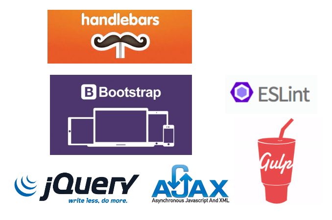

### WD-Web

构建PC Web Site，多页面，前后端分离，框架提供：

1. 基于jQuery的控件库，包含常用组件（页头、页脚、主菜单、DataTable等）
2. 基于Handlebars的前端模板，支持预编译
3. 基于Gulp的前端集成开发环境，包括静态检查，LiveReload，编译打包等功能

#### 技术栈



#### 快速上手

1. 安装[Node.JS](http://nodejs.org)，安装Gulp
```
[sudo] npm install -g gulp
```
2. 下载
```
git clone git@github.com:corncandy/wd-web.git
```
3. 进入目录并安装依赖
```
cd wd-web
npm install
```
4. 开发模式
```
gulp serve
```
此时可以在浏览器里打开[http://localhost:3000](http://localhost:3000)调试，修改源文件可以自动更新页面（LiveReload）
5. 部署模式
```
gulp
```
结束后生成dist目录，包含编译后的资源，可以直接部署于服务器。
6. 部署预览
```
gulp serve:dist
```
完成后可以在浏览器里打开[http://locahost:3001](http://localhost:3001)，预览编译后的页面。
7. 静态代码检查
由ESLint提供静态代码检查能力，通常情况下建议完全修复静态错误。
```
gulp lint
```

#### 目录结构与命名规范

```
app 源代码
|--aas 子系统
   |--account-management.html 页面（小写，减号分割单词）
   |--home.html 子系统首页
|--ams 子系统
|--images 图片资源
   |--aas 子系统
      |--account-management-avatar.png 图片（以页面名开头，加入图片名）
      |--home-background.jpg 图片（以页面名开头，加入图片名）
|--scripts JS资源
   common.js 系统通用JS文件，包含公共逻辑
   |--aas 子系统
      |--account-management.js JS文件（使用页面名）
      |--home.js JS文件（使用页面名）
      |--common.js 子系统通用JS文件（可选）
|--styles CSS资源
   common.css 系统通用CSS文件，包含公共样式
   |--aas 子系统
      |--account-management.css CSS文件（使用页面名）
      |--home.css CSS文件（使用页面名）
      |--common.css 子系统通用CSS文件（可选）
|--templates 模板文件资源
   |--data-table.hbs 模板文件
   |--site-header.hbs 模板文件
|--vendors 第三方类库
   |--fonts 第三方字体资源
   |--scripts 第三方JS资源
      |--bootstrap.min.js
   |--styles  第三方CSS资源
      |--bootstrap.min.css
dist 编译后生成，可部署至Web服务器
gulpfile.babel.js 编译脚本
```

* 所有文件使用小写单词，用减号分隔
* 保持html/js/css文件名一致
* 子系统划分需要与后台开发达成一致，需要配置相应的路由

#### 页面结构
/app/aas/account-management.html
```html
<!DOCTYPE html>
<html>
<head>
  <meta charset="utf-8">
  <meta http-equiv="X-UA-Compatible" content="IE=edge">
  <title>万达统一运营平台</title>
  <meta content="width=device-width, initial-scale=1, maximum-scale=1, user-scalable=no" name="viewport">
  <link rel="stylesheet" href="../vendors/styles/bootstrap.min.css">
  <link rel="stylesheet" href="../vendors/styles/font-awesome.min.css">
  <link rel="stylesheet" href="../vendors/styles/AdminLTE.min.css">
  <link rel="stylesheet" href="../vendors/styles/_all-skins.min.css">
  <!--系统通用CSS文件-->
  <link rel="stylesheet" href="../styles/common.css">
  <!--页面CSS文件-->
  <link rel="stylesheet" href="../styles/aas/account-management.css">
  <!--[if lt IE 9]>
    <script src="vendors/scripts/html5shiv.min.js"></script>
    <script src="vendors/scripts/respond.min.js"></script>
  <![endif]-->
</head>

<!--使用Bootstrap类-->
<body class="hold-transition skin-blue sidebar-mini">
  <div class="wrapper">
    <!--控件接入点-->
    <header class="main-header"></header>
    <aside class="main-sidebar"></aside>
    <div class="content-wrapper">
      <section class="content-header"></section>
      <section class="content">
        <div class="box">
          <div class="data-filter"></div>
          <div class="data-table"></div>
          <div class="data-paginator"></div>
        </div>
      </section>
    </div>
    <footer class="main-footer"></footer>
  </div>
  <script src="../vendors/scripts/jQuery-2.1.4.min.js"></script>
  <script src="../vendors/scripts/handlebars.runtime.min.js"></script>
  <script src="../vendors/scripts/bootstrap.min.js"></script>
  <script src="../vendors/scripts/jquery.slimscroll.min.js"></script>
  <script src="../vendors/scripts/app.js"></script>
  <!--从templates目录下的模板文件自动生成-->
  <script src="../scripts/templates.js"></script>
  <!--系统通用JS文件-->
  <script src="../scripts/common.js"></script>
  <!--页面JS文件-->
  <script src="../scripts/aas/account-management.js"></script>
</body>
</html>
```

/app/scripts/aas/account-management.js
```javascript
'use strict';

$(function() {
  // 初始化WUI框架（生成页头，页脚，主菜单等）
  WUI.init({
    system: 'aas'
  });
});

// 框架初始完成回调，加入页面逻辑
WUI.ready = function() {
  var meta = {
    userID: {
      label: '用户ID'
    }, ...
  };

  // 在加载点上生成控件
  WUI.DataFilter.create({
    $el: $('.data-filter'),
    meta: meta,
    fields: ['mobile', 'userName', 'status'],
    onFilter: function(params) {
      queryData($.extend(params, {
        currentPage: 0,
        pageSize: 1
      }));
    }
  });

  // 在加载点上生成控件
  WUI.DataTable.create({
    $el: $('.data-table'),
    meta: meta,
    fields: ['userID', 'userName', 'mobile', 'email', 'status'],
    list: list,
    operations: [{
      name: '编辑',
      callback: editData
    }, {
      name: '重置密码',
      callback: resetPassword
    }]
  });

  ...
};
```

#### Handlerbars模板

1. 所有的Handlerbars模板文件(.hbs)放入templates目录中
2. 构建系统会生成/app/scripts/templates.js文件，包含预编译的模板
3. 在页面JS中可以通过WUI.templates['模板文件名']引用到模板

#### 设计说明

* 每个路由对应于一个html页面，使用Ajax获取动态资源，实现前后端分离。
* 页面之间相对独立，不会相互影响，开发者根据自身能力可以采用不同的方案实作界面，只要符合命名规范即可。
* 自动化构建系统保障前端优化，如静态检查，资源压缩等。

